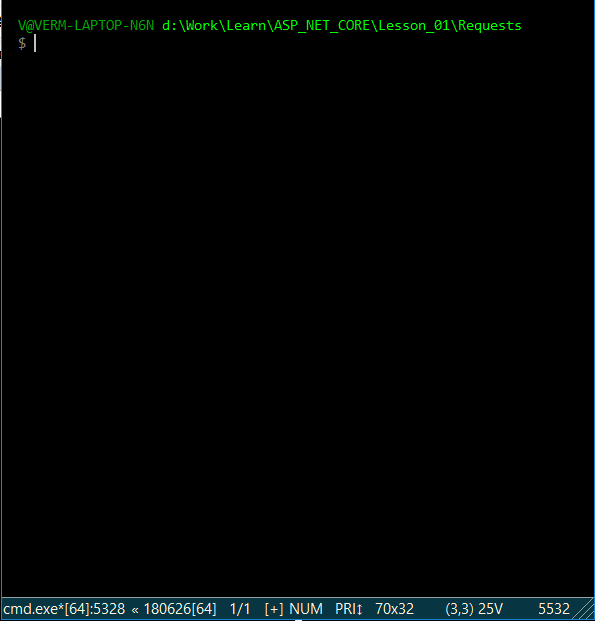

### (Актуальную версию выполненного задания смотри в ветке Lesson_01)  
  
*[Назад](./../README.md)*  
  
### Задание для урока №1  
  
Написать свой контроллер и методы в нем, которые бы предоставляли следующую функциональность  
  
- Возможность сохранить температуру в указанное время  
- Возможность отредактировать показатель температуры в указанное время  
- Возможность удалить показатель температуры в указанный промежуток времени  
- Возможность прочитать список показателей температуры за указанный промежуток времени  
  
---
  
### Пояснения по выполнению задания  
  
Создан контроллер который позволяет сохранять в списке значения температуры за определенные даты.  
Список хранит объекты типа WeatherForecast, в которых хранится значение температуры и дату в которую оно было зафиксировано  
  
В контроллере реализованы следующие методы  

| Имя                      | 	Действие |
|--------------------------|----------------|
|**create**                | создает элемент в списке  
|**read**                  | выдает элементы списка за указанный промежуток дат  
|**update**                | изменяет элемент в списке за указанную дату  
|**delete**                | удаляет элементы из списка за указанный промежуток дат
  
---
  
Примеры запросов к контроллеру (через curl)  
```css  
//Создание элментов в списке  
curl -d -L -X POST "http://localhost:51684/api/weatherforecast/create?date=2020-01-01&temperature=-30"  
curl -d -L -X POST "http://localhost:51684/api/weatherforecast/create?date=2020-01-15&temperature=-25"  
curl -d -L -X POST "http://localhost:51684/api/weatherforecast/create?date=2020-02-02&temperature=-10"  
curl -d -L -X POST "http://localhost:51684/api/weatherforecast/create?date=2020-02-21&temperature=11"  
  
//Просмотр значений за интервал дат  
curl -L -X GET "http://localhost:51684/api/weatherforecast/read?datefrom=2020-01-15&dateto=2020-02-10"  
    
//Изменение значения за определенную дату  
curl -d -L -X PUT "http://localhost:51684/api/weatherforecast/update?date=2020-01-15&temperature=-22"  
  
//Удаление значений за интервал дат
curl -d -L -X DELETE "http://localhost:51684/api/weatherforecast/delete?datefrom=2020-01-15&dateto=2020-02-10"  
```  
  
