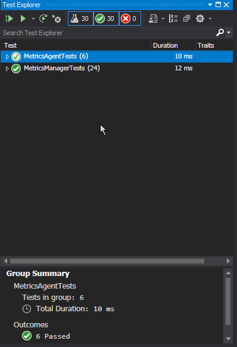

*[Назад](./../README.md)*  
  
### Задание для урока №2  
  
Добавить метод в контроллер агентов проекта менеджера метрик позволяющий получить список
зарегистрированных в системе объектов.  
  
В проект агента сбора метрик добавить контроллеры для сбора метрик, аналогичные менеджеру сбора метрик.
Добавить методы для получения метрик с агента, доступные по следующим путям  
  
- api/metrics/cpu/from/{fromTime}/to/{toTime}/percentiles/{percentile}  
- api/metrics/cpu//from/{fromTime}/to/{toTime}/  
- api/metrics/dotnet/errors-count/from/{fromTime}/to/{toTime}  
- api/metrics/network/from/{fromTime}/to/{toTime}/  
- api/metrics/hdd/left (размер оставшегося свободного дискового пространства в мегабайтах)  
- api/metrics/ram/available (размер свободной оперативной памяти в мегабайтах)  
  
Добавить проект с тестами для агента сбора метрик.  
Написать простые юнит-тесты на каждый метод каждого контроллера в обоих тестовых проектах.  
  
Примечание: перед выполнением задания, создается и наполняется проект MetricsManager согласно методическим указаниям.  
  
---  
  
### Пояснения по выполнению задания  
  
Созданы два прокта **MetricsManager** и **MetricsAgent**.  

В обоих проектах созданы следующие контроллеры:
- **CpuMetricsController**  
- **DotNetMetricsController**  
- **HddMetricsController**  
- **NetworkMetricsController**  
- **RamMetricsController**  
  
В проекте MetricsManager дополнительно создан контроллер - **AgentsController**  
  
В каждом из контроллеров созданы методы согласно методическим указаниям и заданию (без функционала)  
  
Для обоих проектов созданы проекты с юнит тестами. В которых для каждого метода создан простой тест,
проверяющий, что метод при вызове отдаст нужный ответ.  
  
Дополнительно создана библиотека **Metrics.Tools**, в которую вынесен enum **Percentiles**, использующийся в остальных проектах решения.  
  
---  
  
Результат прогона тестов  

  
  