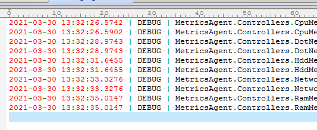
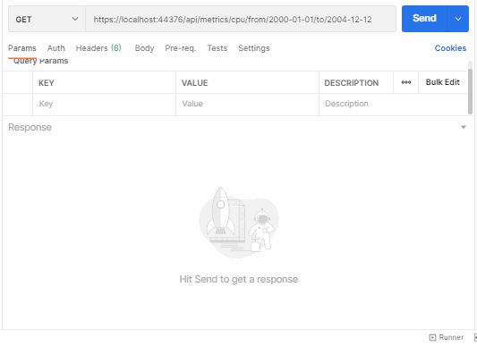

*[Ќазад](./../README.md)*  
  
### «адание дл€ урока є3
  
- [X] 1	ƒобавьте логирование всех параметров в каждом из контроллеров в обоих проектах
- [X] 2	ƒобавьте репозитории дл€ каждого типа метрик в сервис агент сбора метрик
- [X] 3	ƒобавьте обработчики в контроллеры в REST стиле дл€ наполнени€ метриками базы данных
- [X] 4	ƒобавьте тесты на все контроллеры и все методы с использованием заглушек
  
ѕримечание: перед выполнением задани€, создаетс€ и наполн€етс€ проект MetricsManager согласно методическим указани€м.  
  
---  
  
### ѕо€снени€ по выполнению задани€  
  
ѕомимо проекта *MetricsManager* из прошлого урока, создан проект *MetricsAgent* - агент сбора метрик.  
ƒополнительно созданы проекты с юнит тестами дл€ них *MetricsManagerTests* и *MetricsAgentTests*  

¬ проекте *MetricsAgent* добавлено взаимодействие с базой данных SQLite и реализован паттерн репозиторий дл€ взаимодействи€ между базой и агентами сбора метрик.  
  
ƒобавлено логирование дл€ всех методов обоих проектов.  
Ћоги разбиты на несколько видов, вывод€тс€ в каталог Logs р€дом с приложением.  
“ри основных лога в которые попадают сообщени€ уровеней:  
- только Trace  
- только Debug  
- уровень Info и выше  
ѕлюс, дополнительно сделал дл€ удобства отладки, на врем€ разработки приложени€, 
чтобы дл€ каждого класса велс€ отдельный лог. » все они сохран€лись в каталог Logs/Separate  
  
ќбразец лога уровн€ Debug  
  
  
  
  
“ак же дл€ каждого метода сделаны тесты с заглушками (mock-тесты)  
  
  
¬ проекте MetricsAgent при инициализации базы данных происходит ее наполнение тестовыми значени€ми дл€ проверки работы агентов.  
  
ѕримеры запросов к контроллерам проекта MetricsAgent (через curl)  
```css  
curl --location --request GET "https://localhost:44376/api/metrics/cpu/from/2000-01-01/to/2004-12-12"  

curl --location --request GET "https://localhost:44376/api/metrics/dotnet/errors-count/from/2000-01-01/to/2004-12-12"  

curl --location --request GET "https://localhost:44376/api/metrics/hdd/agent/left"  

curl --location --request GET "https://localhost:44376/api/metrics/network/from/2001-01-01/to/2012-12-12"  

curl --location --request GET "https://localhost:44376/api/metrics/ram/available"  
```  
  
---  
  
ƒемонстраци€ запросов к базе данных  
  
  
  