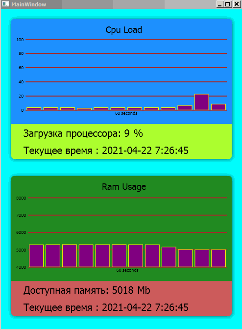

*[Назад](./../README.md)*  
  
### Задание для урока №8  
  
- [X] Практическое задание на данном уроке является творческим. 
Попробуйте поэкспериментировать со стандартными компонентами WPF 
и при помощи верстки и data bindings добавить данные, 
которые бы вам интересно было видеть от нашего агента сбора метрик. 
  
---  
  
### Пояснения по выполнению задания  
  
Создал WPF проект **MetricsManagerClient**, который выводит на экран график для двух типов метрик **Cpu** и **Ram**.  
Для упрощения метрики выводятся только для одного агента.  
  
---  
  
Краткое описание архитектуры программы:  
  
Попытался реализовать паттерна MVVM, так как я его понял (ну и как смог разобратьс в механизме WPF)  
В программе по расписанию (раз в несколько секунд) вызываются Job для метрик, которые через http-запрос 
забирают метрики из приложения **MetricsManager**. Далее метрики передаются в **AllCpuMetrics** (*Model*), 
которая хранит собранные метрики. При обновлении списка метрик, модель отправляет сообщение **OnMetricsChanged**, на которое подписана
**MainWindow.xaml.cs** (*ViewModel*) которая забирает данные из модели и перекладывает их в список привязанный 
к **MaterialCardsCpu** (*View*) - диаграмму отображающие метрики по времени.  
Аналогично сделано для **Ram** метрик.
  
  
  
Пример как можно протестировать работоспособность клиента.  
  
После сборки солюшена. Запустить программы:  
**MetricsAgent.exe** - будет собирать метрики с компьютера и отвечать на порту **5000**.  
**MetricsManager.exe** - будет забирать метрики собранные агентом и складывать их в базу. Отвечает на порту **5050**.  
**MetricsManagerClient.exe** - будет забирать метрики собранные менеджером и выводить их на экран.  
  
---  
  
Дополнительно в программе подключено логгирование c помощью NLog и используется механизм Dependency Injection.    